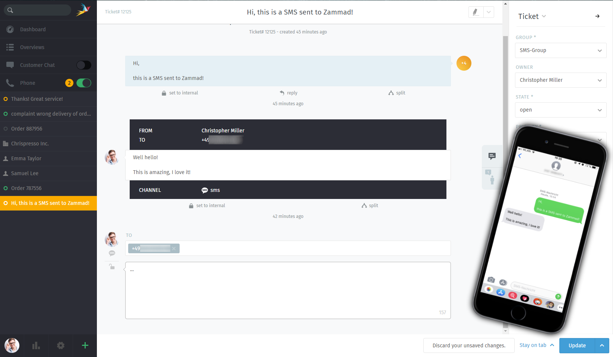

SMS
***

The SMS-Channel has been sponsored by IT-Security experts at `sys4 <https://sys4.de/>`_ .
This channel allows you to receive and receive SMS via Tickets. You can also send notifications to your customers using `Triggers <https://admin-docs.zammad.org/en/latest/manage-trigger.html>`_ . 

.. Note:: Please note that you currently can't initiate a conversation with your customer via SMS! Your customer needs to send you the first SMS!

We currently support the following Providers

 * SMS communication as channel
   * twilio
 * SMS notifications
   * twilio
   * massenversand
   
Below you can find out how to configure Zammad so that you're able to use SMS providers.

Using SMS as Channel
--------------------

.. toctree::
   :maxdepth: 1

   channel-sms/channel-twilio

Using SMS for notifications
---------------------------

.. toctree::
   :maxdepth: 1

   channel-sms/notification-twilio
   channel-sms/notification-massenversand
